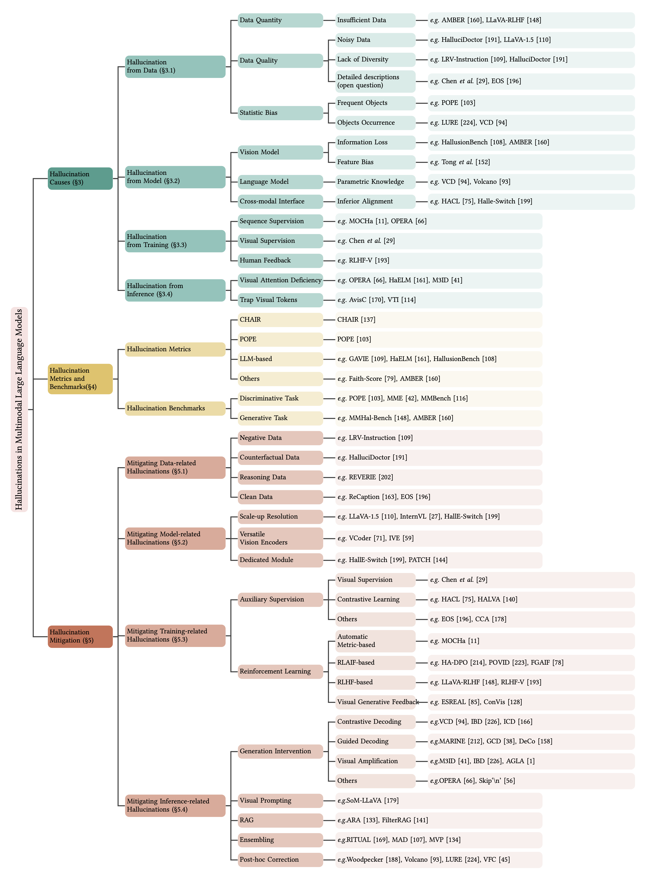

# Awesome MLLM Hallucination  <!-- omit in toc -->

## [Hallucination of Multimodal Large Language Models: A Survey](https://arxiv.org/abs/2404.18930)
### :star: News! We have released a comprehensive survey of MLLM hallucination.

  

----

This is a repository for organizing papres, codes and other resources related to hallucination of Multimodal Large Language Models (MLLM), or called Large Vision-Language Models (LVLM).

Hallucination in LLM usually refers to the phenomenon that the generated content is nonsensical or unfaithful to the provided source content, such as violation of input instruction, or containing factual errors, etc.
In the context of MLLM, hallucination refers to the phenomenon that the generated text is semantically coherent but inconsistent with the given visual content.
The community has been constantly making progress on analyzing, detecting, and mitigating hallucination in MLLM.

#### :books: How to read?
The main contribution of a specific paper is proposing either a new hallucination benchmark (metric) or proposing a hallucination mitigation method.
The analysis and detection of hallucination are only part of the whole paper, serving as the basis of evaluation and mitigation.
Therefore, we divide the papers into two categories: **hallucination evaluation & analysis ** and **hallucination mitigation**.
In each category, the paper are listd in an order **from new to old**.
Note that there might be some duplicated papers in the two categories. Those papers contain both evaluation benchmark and mitigation method.

#### :high_brightness: This project is still on-going, pull requests are welcomed!!

If you have any suggestions (missing papers, new papers, key researchers or typos), please feel free to edit and pull a request. Just letting us know the title of papers can also be a great contribution to us. You can do this by open issue or contact us directly via email.

#### :star: If you find this repo useful, please star it!!!

## Table of Contents <!-- omit in toc -->
- [Hallucination Survey](#hallucination-survey)
- [Hallucination Evaluation & Analysis ](#hallucination-evaluation--analysis)
- [Hallucination Mitigation](#hallucination-mitigation)

### Hallucination Survey
+ [Hallucination of Multimodal Large Language Models: A Survey](https://arxiv.org/abs/2404.18930) (Apr. 30, 2024)
  

### Hallucination Evaluation & Analysis 
+ **Pfram** [Understanding Multimodal Hallucination with Parameter-Free Representation Alignment](https://arxiv.org/abs/2409.01151) (Sep. 02, 2024)
  
  

+ [Pre-Training Multimodal Hallucination Detectors with Corrupted Grounding Data](https://arxiv.org/abs/2409.00238) (Aug. 30, 2024)
  

+ **Reefknot** [Reefknot: A Comprehensive Benchmark for Relation Hallucination Evaluation, Analysis and Mitigation in Multimodal Large Language Models](https://arxiv.org/abs/2408.09429) (Aug. 18, 2024)
  

+ **Hallu-PI** [Hallu-PI: Evaluating Hallucination in Multi-modal Large Language Models within Perturbed Inputs](https://arxiv.org/abs/2408.01355) (Aug. 02, 2024)
  
  

+ **HaloQuest** [HaloQuest: A Visual Hallucination Dataset for Advancing Multimodal Reasoning](https://arxiv.org/abs/2407.15680) (Jul. 22, 2024)
  

+ **ROPE** [Multi-Object Hallucination in Vision-Language Models](https://arxiv.org/abs/2407.06192) (Jul. 08, 2024)
  
  

+ **BEAF** [BEAF: Observing BEfore-AFter Changes to Evaluate Hallucination in Vision-language Models](https://arxiv.org/abs/2407.13442) (Jun. 18, 2024)
  
  

+ **VideoHallucer** [VideoHallucer: Evaluating Intrinsic and Extrinsic Hallucinations in Large Video-Language Models](https://arxiv.org/abs/2406.16338) (Jun. 24, 2024)
  
  

+ **HQHBench** [Evaluating the Quality of Hallucination Benchmarks for Large Vision-Language Models](https://arxiv.org/abs/2406.17115) (Jun. 24, 2024)
  
  

+ [Does Object Grounding Really Reduce Hallucination of Large Vision-Language Models?](https://arxiv.org/abs/2406.14492v1) (Jun. 20, 2024)
  

+ **VGA** [VGA: Vision GUI Assistant -- Minimizing Hallucinations through Image-Centric Fine-Tuning](https://arxiv.org/abs/2406.14056) (Jun. 20, 2024)
  

+ [Do More Details Always Introduce More Hallucinations in LVLM-based Image Captioning?](https://arxiv.org/abs/2406.12663v1) (Jun. 18, 2024)
  

+ **MFC-Bench** [MFC-Bench: Benchmarking Multimodal Fact-Checking with Large Vision-Language Models](https://arxiv.org/abs/2406.11288) (Jun. 17, 2024)
  

+ **AutoHallusion** [AUTOHALLUSION: Automatic Generation of Hallucination Benchmarks for Vision-Language Models](https://arxiv.org/abs/2406.10900v1) (Jun. 16, 2024)
  

+ **Med-HallMark** [Detecting and Evaluating Medical Hallucinations in Large Vision Language Models](https://arxiv.org/abs/2406.10185) (Jun. 14, 2024)
  

+ **MetaToken** [MetaToken: Detecting Hallucination in Image Descriptions by Meta Classification](https://arxiv.org/abs/2405.19186) (May. 29, 2024)
  

+ **THRONE** [THRONE: An Object-based Hallucination Benchmark for the Free-form Generations of Large Vision-Language Models](https://arxiv.org/abs/2405.05256) (May. 08, 2024, CVPR 2024)
  

+ **VALOR-EVAL** [VALOR-EVAL: Holistic Coverage and Faithfulness Evaluation of Large Vision-Language Models](https://arxiv.org/abs/2404.13874) (Apr. 22, 2024)
  
  

+ **ALOHa** [ALOHa: A New Measure for Hallucination in Captioning Models](https://arxiv.org/abs/2404.02904v1) (Apr. 03, 2024, NAACL 2024)
  

+ **UPD** [Unsolvable Problem Detection: Evaluating Trustworthiness of Vision Language Models](https://arxiv.org/abs/2403.20331) (Mar. 29, 2024)
  
  

+ **IllusionVQA** [IllusionVQA: A Challenging Optical Illusion Dataset for Vision Language Models](https://arxiv.org/abs/2403.15952) (Mar. 23, 2024)
  

+ **CounterAnimal** [Do CLIPs Always Generalize Better than ImageNet Models ?](https://arxiv.org/abs/2403.11497) (Mar. 18, 2024)
  

+ **PhD** [PhD: A Prompted Visual Hallucination Evaluation Dataset](https://arxiv.org/abs/2403.11116) (Mar. 17, 2024)
  

+ [AIGCs Confuse AI Too: Investigating and Explaining Synthetic Image-induced Hallucinations in Large Vision-Language Models](https://arxiv.org/abs/2403.08542) (Mar. 13, 2024)
  

+ **Hal-Eval** [Hal-Eval: A Universal and Fine-grained Hallucination Evaluation Framework for Large Vision Language Models](https://arxiv.org/abs/2402.15721) (Feb. 24, 2024)
  

+ **VHTest** [Visual Hallucinations of Multi-modal Large Language Models](https://arxiv.org/abs/2402.14683v1) (Feb. 22, 2024)
  
  

+ **MAD-Bench** [How Easy is It to Fool Your Multimodal LLMs? An Empirical Analysis on Deceptive Prompts](https://arxiv.org/abs/2402.13220) (Feb. 20, 2024)
  

+ **MHaluBench** [Unified Hallucination Detection for Multimodal Large Language Models](https://arxiv.org/abs/2402.03190) (Feb. 20, 2024)
  
  

+ **VQAv2-IDK** [Visually Dehallucinative Instruction Generation: Know What You Don't Know](https://arxiv.org/abs/2402.09717) (Feb. 15, 2024)
  

+ **CorrelationQA** [The Instinctive Bias: Spurious Images lead to Hallucination in MLLMs](https://arxiv.org/abs/2402.03757) (Feb. 06, 2024)
  
  

+ **MMVP** [Eyes Wide Shut? Exploring the Visual Shortcomings of Multimodal LLMs](https://arxiv.org/abs/2401.06209) (Jan. 11, 2024)
  

+ **MOCHa (OpenCHAIR)** [MOCHa: Multi-Objective Reinforcement Mitigating Caption Hallucinations](https://arxiv.org/abs/2312.03631) (Dec. 06, 2023)
  
  

+ **FGHE** [Mitigating Fine-Grained Hallucination by Fine-Tuning Large Vision-Language Models with Caption Rewrites](https://arxiv.org/abs/2312.01701)  (Dec. 04, 2023)
  
  

+ **MERLIM** [Behind the Magic, MERLIM: Multi-modal Evaluation Benchmark for Large Image-Language Models](https://arxiv.org/abs/2312.02219) (Dec. 03, 2023)
  

+ **CCEval** [HallE-Switch: Controlling Object Hallucination in Large Vision Language Models](https://arxiv.org/abs/2310.01779v2) (Dec. 03, 2023)
  
  

+ **HallusionBench** [HallusionBench: An Advanced Diagnostic Suite for Entangled Language Hallucination & Visual Illusion in Large Vision-Language Models](https://arxiv.org/abs/2310.14566) (Nov. 28, 2023)
  

+ **RAH-Bench** [Mitigating Hallucination in Visual Language Models with Visual Supervision](https://arxiv.org/abs/2311.16479) (Nov. 27, 2023)
  

+ **AMBER** [An LLM-free Multi-dimensional Benchmark for MLLMs Hallucination Evaluation](https://arxiv.org/abs/2311.07397) (Nov. 13, 2023)
  
  

+ **Bingo** [Holistic Analysis of Hallucination in GPT-4V(ision): Bias and Interference Challenges](https://arxiv.org/abs/2311.03287) (Nov. 7, 2023)
  
  

+ **FAITHSCORE** [FAITHSCORE: Evaluating Hallucinations in Large Vision-Language Models](https://arxiv.org/abs/2311.01477) (Nov. 2, 2023)
  
  

+ **HaELM** [Evaluation and Analysis of Hallucination in Large Vision-Language Models](https://arxiv.org/abs/2308.15126) (Oct. 10, 2023)
  
  

+ **NOPE** [Negative Object Presence Evaluation (NOPE) to Measure Object Hallucination in Vision-Language Models](https://arxiv.org/abs/2310.05338) (Oct. 9, 2023)
  

+ **LRV (GAVIE)** [Mitigating Hallucination in Large Multi-Modal Models via Robust Instruction Tuning](https://arxiv.org/abs/2306.14565) (Sep., 29 2023)  
  
  

+ **MMHal-Bench** [Aligning Large Multimodal Models with Factually Augmented RLHF](https://arxiv.org/abs/2306.14565) (Sep. 25, 2023)  
  
  

+ **CIEM** [CIEM: Contrastive Instruction Evaluation Method for Better Instruction Tuning](https://arxiv.org/abs/2309.02301) (NeurlPS Workshop)
  

+ **POPE** [Evaluating Object Hallucination in Large Vision-Language Models](https://arxiv.org/abs/2305.10355) (EMNLP 2023)
  
  

+ **CHAIR** [Object Hallucination in Image Captioning](https://arxiv.org/abs/1809.02156) (EMNLP 2018)
  

### Hallucination Mitigation 
+ **RBD** [Mitigating Hallucination in Visual-Language Models via Re-Balancing Contrastive Decoding](https://arxiv.org/abs/2409.06485) (Sep. 10, 2024)
  

+ **MVP** [Look, Compare, Decide: Alleviating Hallucination in Large Vision-Language Models via Multi-View Multi-Path Reasoning](https://arxiv.org/abs/2408.17150) (Aug. 30, 2024)
  
  

+ **ConVis** [Contrastive Decoding with Hallucination Visualization for Mitigating Hallucinations in Multimodal Large Language Models](https://arxiv.org/abs/2408.13906) (Aug. 25, 2024)
  
  

+ **CLIP-DPO** [Vision-Language Models as a Source of Preference for Fixing Hallucinations in LVLMs](https://www.arxiv.org/abs/2408.10433) (Aug. 19, 2024)
  

+ **SID** [Self-Introspective Decoding: Alleviating Hallucinations for Large Vision-Language Models](https://www.arxiv.org/abs/2408.02032) (Aug. 04, 2024)
  
  

+ **ARA** [Alleviating Hallucination in Large Vision-Language Models with Active Retrieval Augmentation](https://arxiv.org/abs/2408.00555) (Aug. 01, 2024)
  

+ **PAI** [Paying More Attention to Image: A Training-Free Method for Alleviating Hallucination in LVLMs](https://arxiv.org/abs/2407.21771) (Jul. 31, 2024)
  
  

+ **MAD** [Interpreting and Mitigating Hallucination in MLLMs through Multi-agent Debate](https://arxiv.org/abs/2407.20505) (Jul. 30, 2024)
  
  

+ **VACoDe** [VACoDe: Visual Augmented Contrastive Decoding](https://www.arxiv.org/abs/2408.05337) (Jul. 26, 2024)
  

+ **REVERIE** [Reflective Instruction Tuning: Mitigating Hallucinations in Large Vision-Language Models](https://arxiv.org/abs/2407.11422) (Jul. 16, 2024)
  
  

+ **BACON** [BACON: Supercharge Your VLM with Bag-of-Concept Graph to Mitigate Hallucinations](https://arxiv.org/abs/2407.03314) (Jul. 03, 2024)
  
  

+ **Pelican** [Pelican: Correcting Hallucination in Vision-LLMs via Claim Decomposition and Program of Thought Verification](https://arxiv.org/abs/2407.02352) (Jul. 02, 2024)
  

+ **MMHalSnowball** [Investigating and Mitigating the Multimodal Hallucination Snowballing in Large Vision-Language Models](https://www.arxiv.org/abs/2407.00569) (Jun. 30, 2024)
  
  

+ **AGLA** [AGLA: Mitigating Object Hallucinations in Large Vision-Language Models with Assembly of Global and Local Attention](https://arxiv.org/abs/2406.12718) (Jun. 18, 2024)
  
  

+ **MedThink** [MedThink: Inducing Medical Large-scale Visual Language Models to Hallucinate Less by Thinking More](https://arxiv.org/abs/2406.11451) (Jun. 17, 2024)
  

+ **TUNA** [Reminding Multimodal Large Language Models of Object-aware Knowledge with Retrieved Tags](https://arxiv.org/abs/2406.10839) (Jun. 16, 2024)
  

+ **CODE** [CODE: Contrasting Self-generated Description to Combat Hallucination in Large Multi-modal Models](https://arxiv.org/abs/2406.01920v1) (Jun. 04, 2024)
  

+ **NoiseBoost** [NoiseBoost: Alleviating Hallucination with Noise Perturbation for Multimodal Large Language Models](https://arxiv.org/abs/2405.20081) (May. 30, 2024)
  

+ **RITUAL** [RITUAL: Random Image Transformations as a Universal Anti-hallucination Lever in LVLMs](https://arxiv.org/abs/2405.17821) (May. 28, 2024)
  
  

+ **HALVA** [Mitigating Object Hallucination via Data Augmented Contrastive Tuning](https://www.arxiv.org/abs/2405.18654) (May. 28, 2024)
  

+ **AvisC** [Don't Miss the Forest for the Trees: Attentional Vision Calibration for Large Vision Language Models](https://arxiv.org/abs/2405.17820) (May. 28, 2024)
  
  

+ **RLAIF-V** [RLAIF-V: Aligning MLLMs through Open-Source AI Feedback for Super GPT-4V Trustworthiness](https://arxiv.org/abs/2405.17220) (May. 27, 2024)
  
  

+ **HIO** [Alleviating Hallucinations in Large Vision-Language Models through Hallucination-Induced Optimization](https://arxiv.org/abs/2405.15356v1) (May. 24, 2024)
  

+ **VDGD** [VDGD: Mitigating LVLM Hallucinations in Cognitive Prompts by Bridging the Visual Perception Gap](https://arxiv.org/abs/2405.15683) (May. 24, 2024)
  

+ **VFC** [Visual Fact Checker: Enabling High-Fidelity Detailed Caption Generation](https://arxiv.org/abs/2404.19752) (Apr. 30, 2024 (CVPR 2024))
  

+ **SoM-LLaVA** [List Items One by One: A New Data Source and Learning Paradigm for Multimodal LLMs](https://arxiv.org/abs/2404.16375) (Apr. 25, 2024)
  
  

+ **Cantor** [Cantor: Inspiring Multimodal Chain-of-Thought of MLLM](https://arxiv.org/abs/2404.16033) (Apr. 24, 2024)
  
  

+ **HSA-DPO** [Detecting and Mitigating Hallucination in Large Vision Language Models via Fine-Grained AI Feedback](https://arxiv.org/abs/2404.14233v1) (Apr. 22, 2024)
  

+ **FACT** [Fact :Teaching MLLMs with Faithful, Concise and Transferable Rationales](https://arxiv.org/abs/2404.11129) (Apr. 17, 2024)
  

+ **SeVa** [Self-Supervised Visual Preference Alignment](https://arxiv.org/abs/2404.10501) (Apr. 16, 2024)
  

+ **DFTG** [Prescribing the Right Remedy: Mitigating Hallucinations in Large Vision-Language Models via Targeted Instruction Tuning](https://arxiv.org/abs/2404.10332) (Apr. 16, 2024)
  

+ **FGAIF** [FGAIF: Aligning Large Vision-Language Models with Fine-grained AI Feedback](https://arxiv.org/abs/2404.05046) (Apr. 07, 2024)
  

+ **ICD** [Mitigating Hallucinations in Large Vision-Language Models with Instruction Contrastive Decoding](https://arxiv.org/abs/2403.18715) (ACL 2024, Mar. 27, 2024)
  

+ **ESREAL** [Exploiting Semantic Reconstruction to Mitigate Hallucinations in Vision-Language Models](https://arxiv.org/abs/2403.16167) (Mar. 24, 2024)
  

+ **Pensieve** [Pensieve: Retrospect-then-Compare Mitigates Visual Hallucination](https://arxiv.org/abs/2403.14401) (Mar. 21, 2024)
  

+ **M3ID** [Multi-Modal Hallucination Control by Visual Information Grounding](https://arxiv.org/abs/2403.14003) (Mar. 20, 2024)
  

+ **DVP** [What if...?: Counterfactual Inception to Mitigate Hallucination Effects in Large Multimodal Models](https://arxiv.org/abs/2403.13513) (Mar. 20, 2024)
  

+ **AIT** [Mitigating Dialogue Hallucination for Large Multi-modal Models via Adversarial Instruction Tuning](https://arxiv.org/abs/2403.10492) (Mar. 15, 2024)
  

+ **HALC** [HALC: Object Hallucination Reduction via Adaptive Focal-Contrast Decoding](https://arxiv.org/abs/2403.00425) (Mar. 01, 2024)
  
  

+ **IBD** [IBD: Alleviating Hallucinations in Large Vision-Language Models via Image-Biased Decoding](https://arxiv.org/abs/2402.18476) (Feb. 28, 2024)
  

+ **CGD** [Seeing is Believing: Mitigating Hallucination in Large Vision-Language Models via CLIP-Guided Decoding](https://arxiv.org/abs/2402.15300) (Feb. 23, 2024)
  

+ **Less is More** [Less is More: Mitigating Multimodal Hallucination from an EOS Decision Perspective](https://arxiv.org/abs/2402.14545) (Feb. 22, 2024)
  
  

+ **LogicCheckGPT** [Logical Closed Loop: Uncovering Object Hallucinations in Large Vision-Language Models](https://arxiv.org/abs/2402.11622) (Feb. 18, 2024)
  
  

+ **POVID** [Aligning Modalities in Vision Large Language Models via Preference Fine-tuning](https://arxiv.org/abs/2402.11411) (Feb. 18, 2024)
  
  

+ **EFUF** [EFUF: Efficient Fine-grained Unlearning Framework for Mitigating Hallucinations in Multimodal Large Language Models](https://arxiv.org/abs/2402.09801) (Feb. 15, 2024)
  

+ **IDK-Instruction** [Visually Dehallucinative Instruction Generation: Know What You Don't Know](https://arxiv.org/abs/2402.09717) (Feb. 15, 2024)
  

+ **MARINE** [Mitigating Object Hallucination in Large Vision-Language Models via Classifier-Free Guidance](https://arxiv.org/abs/2402.08680) (Feb. 13, 2024)
  

+ **Skip \n** [Skip \n: A Simple Method to Reduce Hallucination in Large Vision-Language Models](https://arxiv.org/abs/2402.01345) (Feb. 12, 2024)
  

+ **ViGoR** [ViGoR: Improving Visual Grounding of Large Vision Language Models with Fine-Grained Reward Modeling](https://arxiv.org/abs/2402.06118) (Feb. 09, 2024)
  

+ **LAR-LAF** [Enhancing Multimodal Large Language Models with Vision Detection Models: An Empirical Study](https://arxiv.org/abs/2401.17981) (Jan. 31, 2024)
  

+ **Silkie** [Silkie: Preference Distillation for Large Visual Language Models](https://arxiv.org/abs/2312.10665) (Dec. 17, 2023)
  

+ **HACL** [Hallucination Augmented Contrastive Learning for Multimodal Large Language Model](https://arxiv.org/abs/2312.06968) (Dec. 12, 2023)
  

+ **MOCHa (OpenCHAIR)** [MOCHa: Multi-Objective Reinforcement Mitigating Caption Hallucinations](https://arxiv.org/abs/2312.03631) (Dec. 06, 2023)
  
  

+ **FGHE** [Mitigating Fine-Grained Hallucination by Fine-Tuning Large Vision-Language Models with Caption Rewrites](https://arxiv.org/abs/2312.01701) (Dec. 04, 2023)
  
  

+ **HallE-Switch** [HallE-Switch: Controlling Object Hallucination in Large Vision Language Models](https://arxiv.org/abs/2310.01779v2) (Dec. 03, 2023)
  
  

+ **RLHF-V** [RLHF-V: Towards Trustworthy MLLMs via Behavior Alignment from Fine-grained Correctional Human Feedback](https://arxiv.org/abs/2312.00849) (Dec. 01, 2023)
  
  

+ **OPERA** [OPERA: Alleviating Hallucination in Multi-Modal Large Language Models via Over-Trust Penalty and Retrospection-Allocation](https://arxiv.org/abs/2311.17911) (Nov. 29, 2023)
  
  

+ **VCD** [Mitigating Object Hallucinations in Large Vision-Language Models through Visual Contrastive Decoding](https://arxiv.org/abs/2311.16922) (Nov. 28, 2023)
  
  

+ **HA-DPO** [Beyond Hallucinations: Enhancing LVLMs through Hallucination-Aware Direct Preference Optimization](https://arxiv.org/abs/2311.16839) (Nov. 28, 2023)
  

+ **RAH-Bench** [Mitigating Hallucination in Visual Language Models with Visual Supervision](https://arxiv.org/abs/2311.16479) (Nov. 27, 2023)
  

+ **HalluciDoctor** [HalluciDoctor: Mitigating Hallucinatory Toxicity in Visual Instruction Data](https://arxiv.org/abs/2311.13614) (Nov. 22, 2023)
  
  

+ **Volcano** [Volcano: Mitigating Multimodal Hallucination through Self-Feedback Guided Revision](https://arxiv.org/abs/2311.07362) (Nov. 14, 2023)
  
  

+ **Woodpecker** [Woodpecker: Hallucination Correction for Multimodal Large Language Models](https://arxiv.org/abs/2310.16045) (Oct. 24, 2023)  
  
  

+ **LURE** [Analyzing and Mitigating Object Hallucination in Large Vision-Language Models](https://arxiv.org/abs/2310.00754) (Oct. 1, 2023)  
  
  

+ **LRV-Instruction** [Mitigating Hallucination in Large Multi-Modal Models via Robust Instruction Tuning](https://arxiv.org/abs/2306.14565) (Sep. 29, 2023)  
  
  

+ **LLaVA-RLHF** [Aligning Large Multimodal Models with Factually Augmented RLHF](https://arxiv.org/abs/2306.14565) (Sep. 25, 2023)  
  
  

+ **VIGC** [VIGC: Visual Instruction Generation and Correction](https://arxiv.org/abs/2308.12714) (Sep. 11, 2023)
  
  

+ **HalDectect** [Detecting and Preventing Hallucinations in Large Vision Language Models](https://arxiv.org/abs/2308.06394) (Aug. 18, 2023)
  

